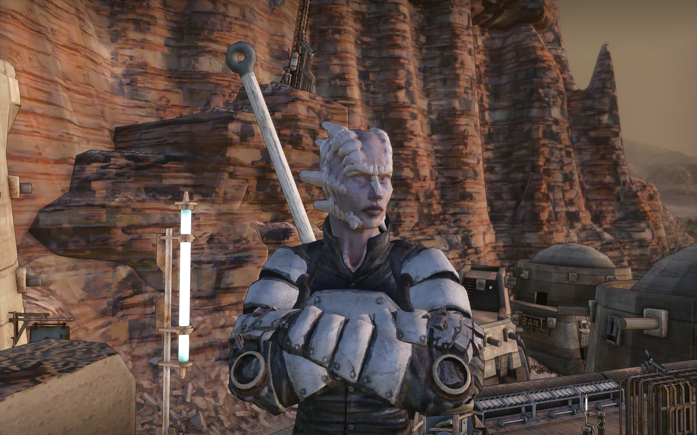

# Ruka-KMM - Ruka Kenshi Mod Manager



> - Graphics Enhancement: [Dust](https://steamcommunity.com/sharedfiles/filedetails/?id=3703458265)
> - Face & Eyes Repaint: [Radiant Better Faces & Eyes](https://steamcommunity.com/sharedfiles/filedetails/?id=2508412096)

## Description

A Kenshi mod manager built with PyQt6, designed for Linux.

## Usage

## Install

## Build & Run

Run from source code:

```shell
uv run ruka-kmm
```

## Todo

- [ ] Basic UI
- [ ] Full mod info parser
- [ ] AI sort export & import
- [ ] Mods dependencies detection
- [ ] `steamcmd` integration

## Inspired By

- Sorting methods (category-based & AI-assisted):
  - [Proper Load Order & You.](https://steamcommunity.com/sharedfiles/filedetails/?id=1850250979)
  - [BEEP-Kenshi-Mod-Manager](https://github.com/Derthi/BEEP-Kenshi-Mod-Manager)
- UI Design: [Rim Sort](https://github.com/RimSort/RimSort)

## Similar Tools

- [BEEP-Kenshi-Mod-Manager](https://github.com/Derthi/BEEP-Kenshi-Mod-Manager)
- [KMM - Kenshi Mod Manager](https://www.nexusmods.com/kenshi/mods/1765)
